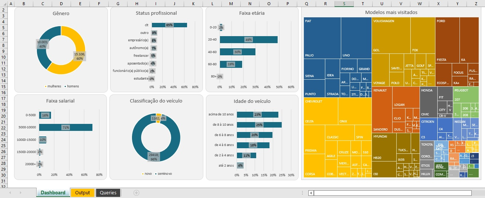

# P2---ICPwithSQL
Análise de ICP (Ideal Customer Profile) com SQL

<h1>PROJETO DE ANÁLISE DE PERFIL DE LEADS (ICP)</h1>

Projeto proposto no Curso de SQL de Midori Toyota (Agradeço muito pelos ensinamentos!!!)
<a href="https://www.udemy.com/course/sql-para-analise-de-dados/">Link para o curso!</a>

<h2>PROPOSTA DO PROJETO</h2>
    <ul>
        <li><h3>Objetivo principal:</h3>
            <ul><li>Criar um dashboard que analise as principais características dos leads que visitam o nosso e-commerce</li></ul>
        </li>
        <li><h3>Objetivos secundários:</h3>
            <ul>
            <li>Comparar o gênero dos leads;</li>
            <li>Observar o status profissional dos leads;</li>
            <li>Observar a faixa etária dos leads;</li>
            <li>Observar a faixa salarial do leads;</li>
            <li>Classificar os veículos visitados;</li>
            <li>Verificar idade dos veículos visitados;</li>
            <li>Classificar os veículos mais visitados por marca.</li>
            </ul>
        </li>
    </ul>
    
<h2>DADOS UTILIZADOS</h2>
    Foram utilizados dados fictícios fornecidos pela professora, assim como no projeto anterior do curso.
    <a href="https://github.com/alexazevedo1705/P1---Car-E-commerce">Análise de E-commerce de automóveis</a>

<h2>PARA SOLUÇÃO DO PROBLEMA FORAM USADOS</h2>
    PostGreSQL (pgAdmin 4)
    Microsoft Excel

Queries usadas podem ser consultadas neste mesmo repositório.

<h2>CONCLUSÕES</h2>
    
    <ul>
        <li>Os leads que visitam nosso site são na sua maioria mulheres, portanto podemos direcionar nossos anúncios para melhor enquadrar essa fatia dos leads.</li>
        <li>A maioria dos leads trabalha em regime clt, tem idade entre 20-40 anos e renda entre 5000-10000. O que nos trás maior entendimento sobre o ICP.</li>
        <li>Os leads que visitam nosso site se interessam mais por veículos seminovos, com pelo menos 6 anos de idade, e as três marcas mais visitadas são FIAT, Volkswagen e Chevrolet.</li>
    </ul>

<h2>Mais uma vez gostaria de agradecer a <a href="https://www.udemy.com/course/sql-para-analise-de-dados/">Midori Toyota</a> pelo curso. Me foi muito útil!!! Tambem gostaria de recomendar este curso para qualquer um pois a linguagem é muito prática e acessível, creio que é um ótimo ponto de partida para quem deseja iniciar os estudos em SQL e até mesmo em Excel.</h2>
